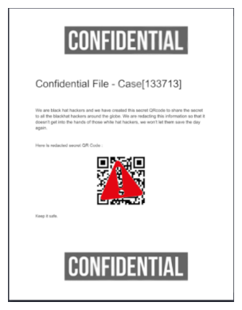
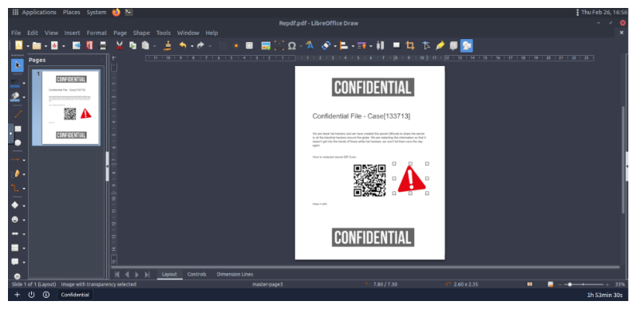
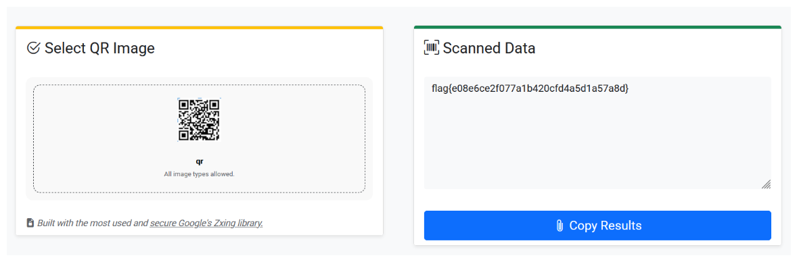

# Confidential - TryHackMe Writeup

We got our hands on a confidential case file from some self-declared "black hat hackers"... it looks like they have a secret invite code available within a QR code, but it's covered by some image in this PDF! If we want to thwart whatever it is they are planning, we need your help to uncover what that QR code says!

**Key Vulnerabilities / Concepts:**

- PDF Layer Analysis
- Digital Forensics (Basics)

## Table of Contents

- [Introduction](#introduction)
- [Analysis](#analysis)
- [Exploitation](#exploitation)
- [Summary](#summary)

---

## Introduction

We start off by reading the info given for the challenge:

> We got our hands on a confidential case file from some self-declared "black hat hackers"... it looks like they have a secret invite code available within a QR code, but it's covered by some image in this PDF!

**Access this challenge** by deploying the machine attached to this task on TryHackMe.
The file you need is located in `/home/ubuntu/confidential` on the VM.

Check out similar content on TryHackMe:

- [Intro to digital forensics](https://tryhackme.com/room/introdigitalforensics)

---

## Analysis

We're given one PDF in the system named `Repdf.pdf` containing one page with the information below:

_(Really sorry for bad quality but it's readable :])_

---

## Exploitation

So I opened the PDF in **LibreOffice** and started poking around. I tried selecting the layers and quickly realized that the redacted emoji added over the QR code is just an object that can be moved!

I was able to just slide it over or remove it entirely, as you can see here:

Now that we have the clear QR code, let's scan it and see where it leads!!

After scanning the QR, we get our flag:

**Final Flag**: `flag{e08e6ce2f077a1b420cfd4a5d1a57a8d}`

---

## Summary

The **Confidential** challenge is a nice intro to PDF forensics. It shows that "redacting" information by just placing an image over it isn't secure at all if the layers aren't flattened. By using a tool like LibreOffice, we could easily move the top layer and reveal the hidden QR code.

---

Happy Hacking! ❤️ 💻
