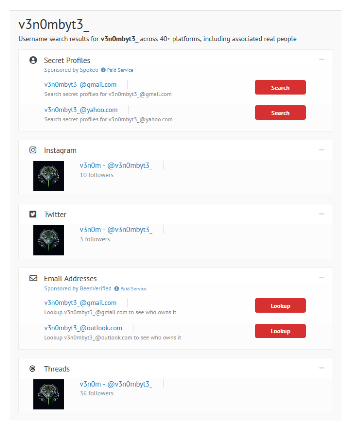
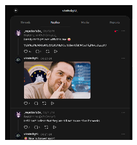
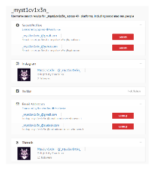
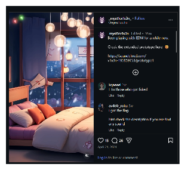
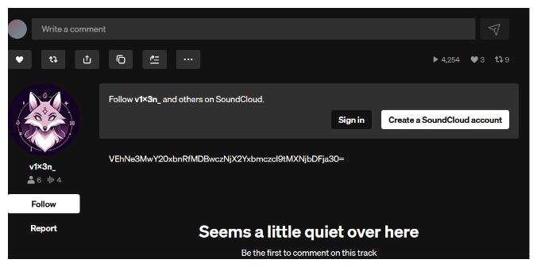
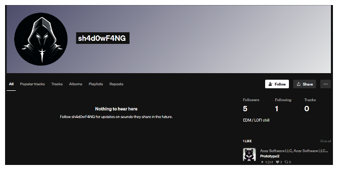
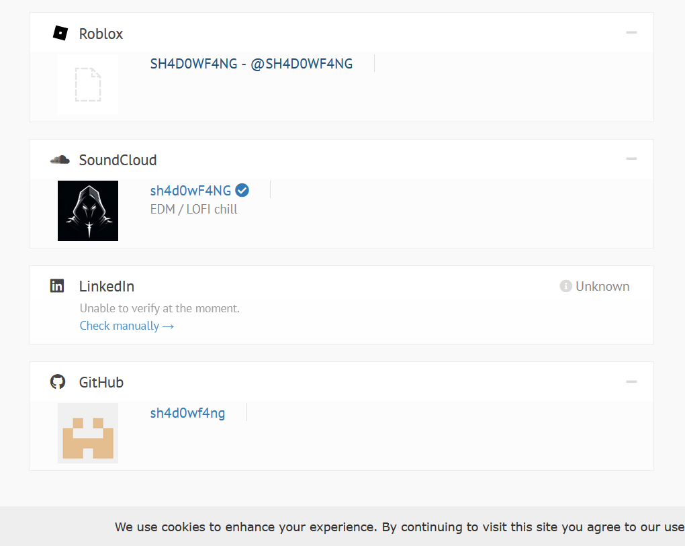
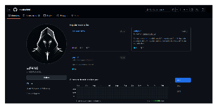
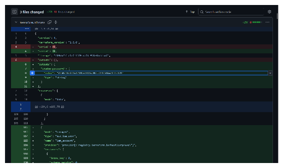

# Operation Slither - TryHackMe Writeup

This room simulates tracking a hacker group (Sneaky Viper) through OSINT techniques, following forum posts to uncover operators' identities and leaked data across platforms.

[](https://tryhackme.com/room/operationslitherIU)
[](#)

**Key Concepts / Skills:**

- User Enumeration
- Social Media Intelligence (SOCMINT)
- Cross-Platform Correlation
- Metadata & Commit History Analysis
- Base64 Decoding

## Table of Contents

- [Task 1: The Leader](#task-1-the-leader)
- [Task 2: The Sidekick](#task-2-the-sidekick)
- [Task 3: The Last Operator](#task-3-the-last-operator)
- [Key Takeaways](#key-takeaways)

---

## Task 1: The Leader

**We got access to a hacker forum and found the info of our company on sale! All the info we have is in this post. Find any information related to the leader of the Sneaky Viper group.**

```shell
Full user database TryTelecomMe on sale!!!

As part of Operation Slither, we've been hiding for weeks in their network and have now started to exfiltrate information. This is just the beginning. We'll be releasing more data soon. Stay tuned!

@v3n0mbyt3_

---
```

#### Reconnaissance Guide

- Begin with the provided username and perform a broad search across common social platforms.
- Correlate discovered profiles to confirm ownership and authenticity.
- Review interactions, posts, and replies for potential leads.

Thus we then search for the username `v3n0mbyt3_` on [idcrawl.com](https://www.idcrawl.com/u/v3n0mbyt3_).

There we got multiple profiles and mails for the username which will be useful for us:



I checked Instagram and Twitter, but nothing was there. So I then went to Threads, and we got his post. We can see in the replies that there are two accounts having a conversation:



Here we get the base64 text:

```base64
VEhNe3NsMXRoM3J5X3R3MzN0el80bmRfbDM0a3lfcjNwbDEzcyF9
```

Which after decoded reads: `THM{sl1th3ry_tw33tz_4nd_l34ky_r3pl13s!}`

**Answers for Task 1:**

1. Aside from Twitter / X, what other platform is used by v3n0mbyt3\_? Answer in lowercase.
   -> `threads`
2. What is the value of the flag?
   -> `THM{sl1th3ry_tw33tz_4nd_l34ky_r3pl13s!}`

---

## Task 2: The Sidekick

**A second message has been made public! Our account in their forum was deleted, so we couldn't get the operator's handle this time. Follow the crumbs from the first task and hunt any information related to the second operator of the group.**

```shell
60GB of data owned by TryTelecomMe is now up for bidding!

Number of users: 64500000 Accepting all types of crypto
For takers, send your bid on Threads via this handle:

HIDDEN CONTENT
-----------------------------------------------------------------------------------------------------
You must register or log in to view this content
```

#### Reconnaissance Guide

- Use related usernames or connections identified in earlier steps to expand reconnaissance.
- Enumerate additional platforms for linked accounts and shared content.
- Follow media or resource references across platforms to trace information flow.

Here we also check [idcrawl](https://www.idcrawl.com/u/_myst1cv1x3n_) for `_myst1cv1x3n_`. We got the following results, from which we already checked `Threads`, so we go to `Instagram`:



While checking the `Instagram`, there is a post with an EDM song playing and a `SoundCloud` link:



Thus we go to the `SoundCloud` link, and there are 4 tracks given by `v1x3n_`. With the hint from the `Instagram` comments, I was checking each song's description and in one of them (`Prototype2`), I found something useful:



Which decodes to: `THM{s0cm1nt_00ps3c_f1ng3r_m1scl1ck}`

**Answers for Task 2:**

1. What is the username of the second operator talking to v3n0mbyt3 from the previous platform?
   -> `_myst1cv1x3n_`
2. What is the value of the flag?
   -> `THM{s0cm1nt_00ps3c_f1ng3r_m1scl1ck}`

---

## Task 3: The Last Operator

**A new post is up. Hunt the third operator using past discoveries and find any details related to the infrastructure used for the attack.**

```shell
FOR SALE

Advanced automation scripts for phishing and initial access!

Inclusions:
- Terraform scripts for a resilient phishing infrastructure
- Updated Google Phishlet (evilginx v3.0)
- GoPhish automation scripts
- Google MFA bypass script
- Google account enumerator
- Automated Google brute-forcing script
- Cobalt Strike aggressor scripts
- SentinelOne, CrowdStrike, Cortex XDR bypass payloads

PRICE: $1500
Accepting all types of crypto
Contact me on REDACTED@protonmail.com

---
```

#### Reconnaissance Guide

- Identify secondary accounts through visible interactions (likes, follows, collaborations).
- Extend reconnaissance into developer or technical platforms associated with the identity.
- Analyze activity history (such as repositories or commits) for embedded information.

---

While checking the `SoundCloud` account from the previous task, I came across this account which seems similar to the naming pattern we had before and also followed `v1x3n_`, so it concludes that this is our third operator.



Thus the third operator is **sh4d0wF4NG**.

To find more about this username, we again use [idcrawl](https://www.idcrawl.com/u/sh4d0wf4ng) and found three accounts: **SoundCloud**, **Roblox**, and **GitHub**.



Naturally, **GitHub** is the useful one for us.



There are only three repos total: two are forked and one is owned by the operator himself (`red-team-infra`). I looked at the commit history and there were only two days which had commits. After checking the commit history of that original repo, I found a `shadow-password` with the value `VEhNe3NoNHJwX2Y0bmd6X2wzNGszZF9ibDAwZHlfcHd9`, which decodes to:

`THM{sh4rp_f4ngz_l34k3d_bl00dy_pw}`



**Answers for Task 3:**

1. What is the handle of the third operator?
   -> `sh4d0wF4NG`
2. What other platform does the third operator use? Answer in lowercase.
   -> `github`
3. What is the value of the flag?
   -> `THM{sh4rp_f4ngz_l34k3d_bl00dy_pw}`

---

## Key Takeaways

- **Username Correlation**: Reusing usernames across platforms is a major OPSEC failure that allows for easy tracking.
- **SOCMINT**: Social media interactions (likes, follows, replies) can reveal hidden connections between threat actors.
- **Commit History**: Sensitive information (like passwords) can often be found in the history of public repositories, even if they are removed in later commits.
- **Platform Pivoting**: Pivoting from one discovered handle to technical platforms like GitHub can reveal infrastructure details.

Happy Hacking ❤️ 💻
