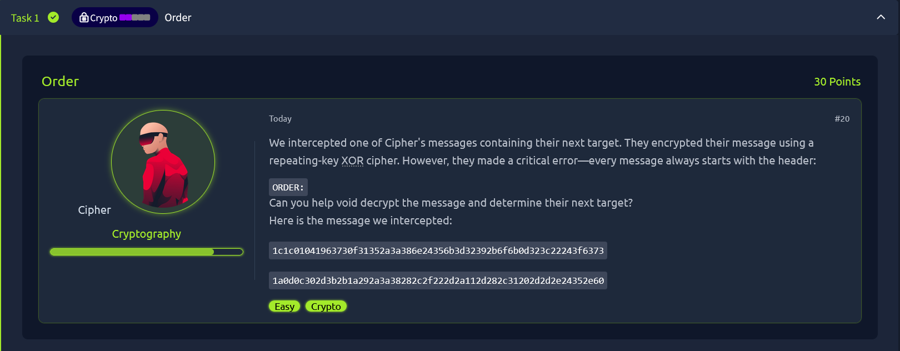

# TryHackMe Room: Crypto Order



## Challenge Overview

The Crypto Order room from TryHackMe is an entry-level cryptography puzzle where participants intercept an encrypted message that always begins with a known header: ORDER:. The ciphertext is protected using a repeating-key XOR cipher, and the task is to decrypt the message and extract the target name, which serves as the flag.

---

## 🧾 Metadata

| Key            | Value                                         |
| -------------- | --------------------------------------------- |
| **Room**       | [ORDER](https://tryhackme.com/room/hfb1order) |
| **Difficulty** | Easy                                          |
| **Category**   | Cryptography / XOR / Static Analysis          |
| **Flag**       | `THM{the_hackfinity_highschool}`        |
| **Author**     | [Valay-2004](https://github.com/Valay-2004)   |
| **Date**       | 2025-07-20                                    |

---

## Objective

- **Decrypt** the provided XOR-encrypted hex message.
- **Extract** the flag (Cipher’s next target) from the decrypted text.

## Tools Used

- Python (for scripting/automation)
- XOR cipher analysis
- Hex & bytes manipulation

---

## Step-by-Step Solution

**1. Analyze the Problem**

- The given ciphertext appears as hex; it represents a message encrypted with a repeating-key XOR cipher.
- We know the message should begin with `ORDER:` (a known-plaintext attack scenario).

**2. Convert Hex to Bytes**

```py
ciphertext_hex = (
"1c1c01041963730f31352a3a386e24356b3d32392b6f6b0d323c22243f6373"
"1a0d0c302d3b2b1a292a3a38282c2f222d2a112d282c31202d2d2e24352e60"
)
ciphertext = bytes.fromhex(ciphertext_hex)
```

**3. XOR Crib Attack with Known Header**

- XOR each byte of "ORDER:" with the first 6 bytes of the ciphertext to recover the key:

```py
header_part = b"ORDER:"

for i in range(len(ciphertext)):
    candidate = xor(ciphertext[i:i+len(header_part)], header_part)
    if candidate.isalnum():
        print(candidate)
```
> Output revealed: **SNEAKY** is the key. 🕵️‍♂️

**4. Full Decryption**
```py
print(f'Here is your flag: {xor(ciphertext, "SNEAKY")}')
```
✅ Done! We get the flag in clean text.   


The decrypted message is:
```go
Here is your flag: b'ORDER: Attack at dawn. Target: THM{the_hackfinity_highschool}.'
```

<h2>Happy hacking! 🕵️‍♂️💻🚩<br>    
Follow my GitHub for more writeups and CTF solutions!</h2>
